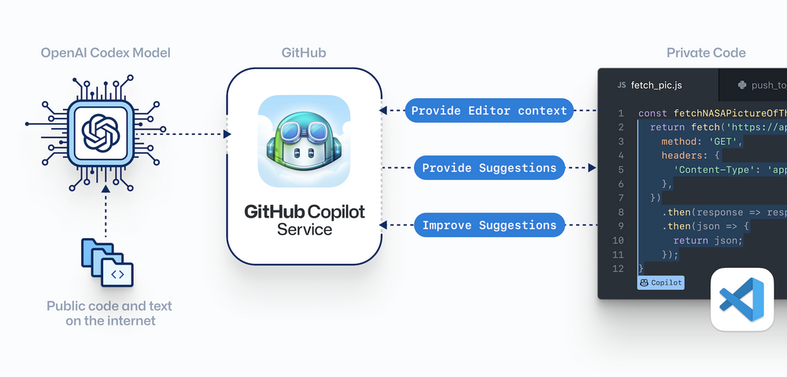

# GitHub Copilot and Company

How can we use Copilot to help us write code?

https://dagshub.com/blog/github-copilot-not-code/

"""
Instructions to Copilot:
- Create a Python-Generated function that illustrates the proportion of current coders in the United States who are using GitHub Copilot.
Data to know about Copilot and use in the visualizations:
- Copilot was released: 6/29/2021, 9:26:17 AM
- According to VSCode, there are 3,450,113 installs of the extension.

From Statista:
There are 27.7 million software developers in the world as of 2023.
There are 7.5 million software developers in the United States as of 2023.
> question for copilot
- What is the proportion of current coders in the United States who are using GitHub Copilot?
> answer from copilot (generated by just typing in the question)
- (If there are 7.5 million) software developers in the United States as of 2023, and 3,450,113 installs of the extension, then the proportion of current coders in the United States who are using GitHub Copilot is 0.46 or 46%.
Let's visualize this:

Languages [1]:
- 65.36% use JavaScript as their primary coding language.
- 55.08% HTML/CSS,
- 49.43% SQL,
- 48.07% Use Python as their primary coding language.
- VSCode is a popular code editor and as of Feb. 1 2021, it had 14 million users.

https://github.blog/wp-content/uploads/2022/09/copitlot2.png?resize=1024%2C870?w=1024

[1] - https://www.statista.com/statistics/793628/worldwide-developer-survey-most-used-languages/
"""

# Different Visualizations

## Proportion of current coders in the United States who are using GitHub Copilot

## Proportion of current coders in the United States who are using GitHub Copilot as a Circle

Question for you copilot: What libraries in Python are you trained to use?
Answer: I'm trained to use the following libraries: pandas, numpy, matplotlib, seaborn, sklearn, tensorflow, keras, and pytorch.
Question: Are you familiar with any other libraries?
Answer: I'm also familiar with the following libraries: plotly, folium, and streamlit.
Question: Could you please list all the libraries you are familiar with in a list? I need to know EVERY library you are familiar with.
Answer: I'm familiar with the following libraries: pandas, numpy, matplotlib, seaborn, sklearn, tensorflow, keras, pytorch, plotly, folium, and streamlit. I also know how to use the following libraries: scipy, statsmodels, nltk, gensim, and spacy. I also can help write code in the following languages: JavaScript, HTML/CSS, SQL, and Java.

# Table of Contents

1. [Demo 1 - Drudge Report Scraping](./src/webscraping_demo.py)
2. [Demo 2 - Regex Pattern Development](./src/regex_creation.py)
3. [Demo 3 - Sentiment Analysis](./src/sentiment_analysis.py)
4. [Demo 4 - Data Visualization](./starting_files/making_custom_datavisuals.ipynb) - A walkthrough of how I made a custom data visualization using matplotlib, and GitHub Copilot.
5. [Demo 5 - Excel Files](./starting_files/excelfiles.py)
6. [Debugging Prompt Generator](./demos/debugging/debugging_helper.ipynb)

# Other Demos
- [Chuck Norris Description Finder](./demos/chucknorrisfinder/chuck.py) - Scrapes Wikipedia for articles describing Chuck Norris and returns the paragraph and title of the first article it finds using regex.

## If you'd like me to present more on this topic let me know! 

# Things I've worked on with GitHub Copilot

| Project | Last Commit | Code Size | Commit Activity | Issues |
|---|---|---|---|---|
| [Lorebook Generator for NovelAI](https://github.com/grahamwaters/lorebook_generator_for_novelai) |      | A Python script that generates a custom JSON lorebook (based on pulls from Wikipedia articles) for the website NovelAI. |
| [PySeas](https://github.com/grahamwaters/PySeas) |     | Utilizing NOAA buoy camera catches to track the sunset across the vast surface of the earth's oceans. |
| [UAP Report Analysis](https://github.com/grahamwaters/uap_report_analysis) |    | A Python script that analyzes the UAP report released by the US government in June 2021. | Jan. 2023 |

# This Presentation 📢

| **Presentation Name** | **Topics** | **Focus** | **Date Estimated** | **Location** |
|---|---|---|---|---|
| GitHub Copilot and LLM for Augmented Intelligence |     | GitHub Copilot, NovelAI's Snek and responsible use of AI assistants. | Feb 8th 2023 | Austin Python Meetup |

# How to Support My Work

If you'd like to contribute to the hours, I spend staring at my screen in deep concentration, I welcome any caffeine donations. ☕ Also, if you'd like to sponsor a project you see on my page, please let me know where I should focus my attention. Open Source is a big brave new world. Cheers!

<h3> You can also find me on Discord by clicking below.</h3>

